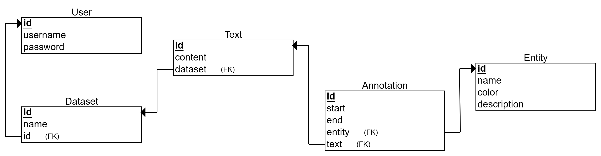

# NERTator
This is a complete back-end API built with Django, designed for creating datasets that can be used for named entity recognition tasks. The API is fully equipped with CI/CD and Observability features, ensuring that the code is efficiently tested, built, and deployed. The purpose of this API is to provide a robust and reliable solution for developers looking to create annotated datasets that can be used to train machine learning models for named entity recognition. With this API, you can easily manage and annotate your datasets, making it a valuable tool for NLP practitioners and researchers.

## Tech Stack
- Django
- PostgreSQL
- Prometheus
- Grafana
- Terraform
- GitHub Actions

## Relational Model

